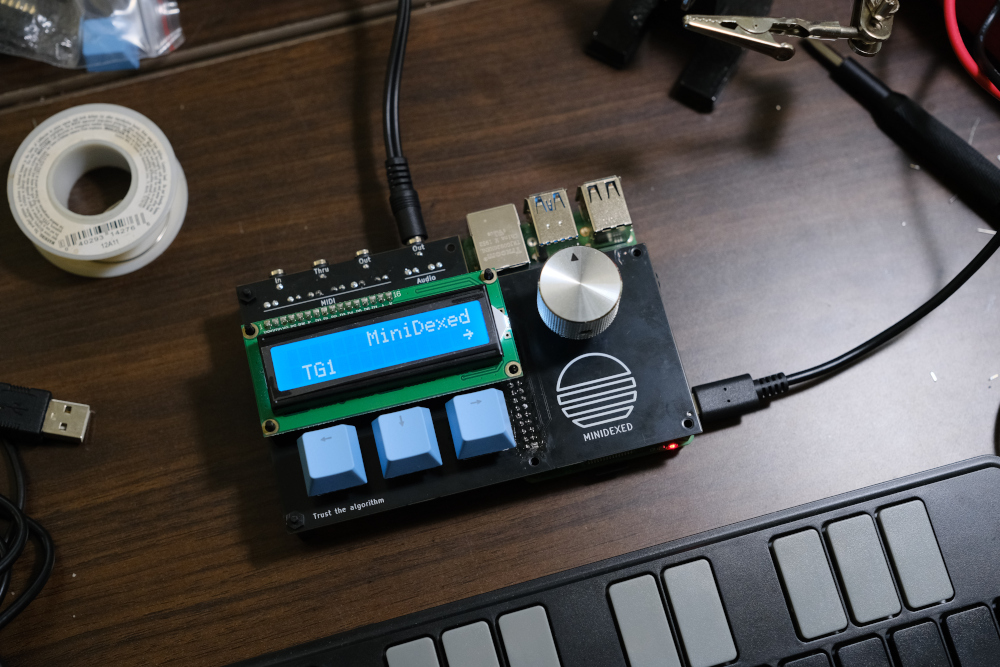

> [!CAUTION]
> This project was made by a JavaScript developer, not an electrical engineer.
>
> It should be assumed that everything is wrong and the project will set your house on fire.
>
> I am not responsible for anything ever.





# MiniDexed PCB

Custom PCB for [MiniDexed](https://github.com/probonopd/MiniDexed), an open-source FM synthesizer. It has:

- An endless encoder
- 3 Cherry buttons (back/home/select)
- A 1602 display
- 3.5mm TRS MIDI in/thru/out
- USB MIDI
- 3.5mm TRS audio out (via the PCM5102 DAC)

See the [writeup on my blog](https://handeyeco.github.io/tech-blog/minidexed-pcb/) for a full explanation of the circuit.

Thanks to lots of folks!

- [probonopd](https://github.com/probonopd) and the whole MiniDexed team
- [diyelectromusic](https://diyelectromusic.com/) for MiniDexed work and PCB design notes
- The whole [Dexed](https://github.com/asb2m10/dexed) lineage
- The [KiCad](https://www.kicad.org/) maintainers

## Builds

Look in `/gerbers/` for build files and BOMs.

### 20240727

Working with the [MiniDexed 2024-01-16 release](https://github.com/probonopd/MiniDexed/releases/tag/2024-01-16).

No known issues (although MIDI out is untested right now). The whole thing is about the size of a Korg NTS-1 and costs roughly $15/PCB to make (including SMT assembly and SMT parts; not including the Pi, THT components, or shipping).

Required changes to `minidexed.ini`:

```
# Sound device
SoundDevice=i2s
#SoundDevice=pwm
#SoundDevice=hdmi

# ...unchanged...

ButtonPinBack=16
ButtonActionBack=click
ButtonPinSelect=27
ButtonActionSelect=click
ButtonPinHome=26
ButtonActionHome=click

# ...unchanged...
```

- For JLCPCB PCB assembly
  - SMD BOM is `minidexed-bom-smd.csv`
  - Pick-and-place position file is `minidexed-bottom-pos.csv`
  - I'm not an expert and can't help much, I followed [this video](https://www.youtube.com/watch?v=VejO8rDdhzo)
- Non-SMD components:
  - x1 [RPi](https://www.adafruit.com/product/3055)
    - I used the 3 because the 4 is hot AF
  - x3 [Cherry switches](https://www.digikey.com/en/products/detail/cherry-americas-llc/MX1A-E1NW/20180) 
    - PCB-mount is best: `MX1A-_1NW`, the `W` is PCB mount
  - x3 Cherry compatible key caps
  - x1 Encoder
    - I have no idea what encoder I used, [maybe this](https://www.digikey.com/en/products/detail/bourns-inc/PEC11R-4215F-S0012/4499664?s=N4IgTCBcDaIGwFYwFoAKBRAwgRmwJWQBYxsEAxZAZWwgF0BfIA)
    - I used a switched encoder
    - Shaft height/style depends on the enclosure/knob
  - x1 Knob for the encoder
  - x4 3.5mm TRS
    - [Like this one](https://www.mouser.com/ProductDetail/SparkFun/PRT-08032?qs=WyAARYrbSnZFBWwuc8Qktw%3D%3D)
    - I like the switched ones because they have 5 pins vs 3 pins which makes the connection to the PCB more solid
    - MIDI is TRS, that's why there's 4 (x3 MIDI, x1 audio)
  - x1 16x2 LCD display
    - My understanding is that these 16x2 LCDs are pretty generic, something [like this](https://www.adafruit.com/product/181) should work
  - x1 10k (103) trim pot
    - For the LCD; [like these](https://www.amazon.com/gp/product/B0CZVY726N)
  - x1 2x20 2.54mm female header (for the Pi)
  - x1 1x16 2.54mm male header (for the LCD)
  - x1 1x16 2.54mm female header (for the LCD)
    - optional, I soldered mine into the PCB to keep things short
  - I think all the mounting holes and spacers are M2.5 (since that's what the Pi uses)
  - All this stuff is pretty generic and highly available
  - **Don't trust me**, double check your footprints or be prepared to reorder things


